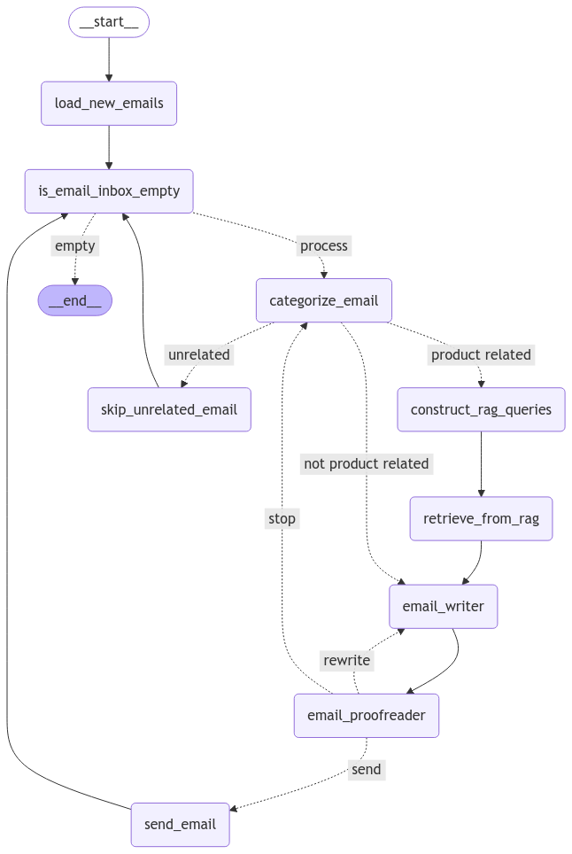

# Gmail Email Automation with LangGraph

An AI-assisted customer support program that reads recent Gmail inbox messages, classifies them, looks up relevant business information, writes replies, and saves approved replies in **Gmail Drafts** for a person to review and send.

The application runs locally in Python. Groq supplies the language model, Google supplies text embeddings and Gmail access, and Chroma stores the searchable knowledge index on your computer.

**Current behavior: one batch per launch, drafts only.** It does not send replies automatically or keep monitoring after the batch finishes. The provided environment template selects fictional sample knowledge.

Read [workflow.md](workflow.md) for the detailed architecture, library definitions, database layout, authentication, and code-to-email execution flow.

## What the program does

1. Looks for up to 50 inbox messages from the last eight hours.
2. Filters out your own messages and threads found in the existing draft list.
3. Classifies each eligible message as a product inquiry, complaint, feedback, or unrelated.
4. For product inquiries, retrieves information from the selected knowledge index.
5. Writes a response and asks an AI proofreader to review it, with at most three writing attempts.
6. Creates a threaded Gmail draft when the response passes review; skips unrelated messages and messages that fail all three reviews.
7. Prints results and writes a count summary to `last_run.json` after a successful CLI batch.

Unrelated messages are not deleted, archived, or marked as read by this workflow. A draft is not a sent message. AI review is not a guarantee that the reply is factually correct.

## Workflow picture



This supplied image illustrates the main stages. In the current code, `send_email` means **create a Gmail draft**, and exhausted retries go through `discard_failed_email` back to the inbox check. The image shows an older stop path. See the [current graph and explanation](workflow.md#3-current-workflow-graph).

## Quick start after setup

After completing the setup below, open PowerShell in the project folder:

```powershell
cd langgraph-email-automation
.\.venv\Scripts\python.exe main.py
```

Open Gmail's **Drafts** folder after the batch completes. In sample mode, every created draft starts with a notice that its business information is fictional.

To run a synthetic test without accessing Gmail:

```powershell
.\.venv\Scripts\python.exe demo.py
```

The demo still calls Groq and Google's embedding API. It uses a fake email, a fake Gmail adapter, and a separate `db_demo` index; it does not read or write Gmail messages.

## Set up from scratch

### 1. Prerequisites

You need Python **3.12** for the environment tested with this project, internet access, a Gmail account, a Groq API key, a Gemini API key, and a Google Cloud project with Gmail API OAuth credentials.

The examples below use Windows PowerShell. Python packages are isolated in `.venv`. No Node.js installation, external SQL server, Chroma cloud account, SMTP password, or OpenAI API key is needed for the current configuration.

### 2. Create the environment and install dependencies

Clone this repository, then create the environment:

```powershell
git clone https://github.com/ashok-dahal-codes/langgraph-email-automation.git
cd langgraph-email-automation
```

From the project root:

```powershell
py -3.12 --version
py -3.12 -m venv .venv
.\.venv\Scripts\python.exe -m pip install -r requirements-lock.txt
.\.venv\Scripts\python.exe -m pip check
```

`requirements-lock.txt` records the exact installed package versions from the working environment. `requirements.txt` lists the top-level dependencies without pins and can be used for a deliberate fresh dependency resolution:

```powershell
.\.venv\Scripts\python.exe -m pip install -r requirements.txt
```

Prefer the lock file when reproducing this setup. A lock file does not make an environment portable across all Python versions and operating systems. The old `venv` directory in this copy points to a Python installation that no longer exists; use `.venv`. If you move the project to a different computer, recreate the environment instead of copying it.

Activation is optional because every command explicitly invokes `.venv\Scripts\python.exe`. If you want to activate it, use `.\.venv\Scripts\Activate.ps1`.

### 3. Create or update `.env`

Copy the provided template, then fill in your own values:

```powershell
Copy-Item .env.example .env
```

Use these settings in `.env` beside `main.py`:

```dotenv
MY_EMAIL=your_account@gmail.com
GROQ_API_KEY=replace_with_your_groq_key
GOOGLE_API_KEY=replace_with_your_gemini_key
KNOWLEDGE_MODE=sample
GROQ_MODEL=openai/gpt-oss-120b
EMBEDDING_MODEL=models/gemini-embedding-001
```

Keep working keys already present in your local file. Do not replace them with the example text.

| Setting | Purpose | Required/default |
| --- | --- | --- |
| `MY_EMAIL` | Gmail account whose inbox should be processed; used to exclude your own messages | Required for live use; must match the signed-in account |
| `GROQ_API_KEY` | Authenticates language-model requests to Groq | Required for AI processing |
| `GOOGLE_API_KEY` | Authenticates Google embedding requests | Required for indexing and product-question retrieval |
| `KNOWLEDGE_MODE` | Selects sample or business knowledge | `sample` or `production`; code defaults to `production`, the example environment selects `sample` |
| `GROQ_MODEL` | Groq-hosted chat model | Defaults to `openai/gpt-oss-120b` |
| `EMBEDDING_MODEL` | Google's embedding model | Defaults to `models/gemini-embedding-001` |

`src/config.py` loads `.env` using a path relative to the project, not the terminal's current directory. Existing environment variables take precedence over `.env` because `load_dotenv()` does not override them by default. Restart the process after changing settings.

### 4. Obtain the two AI API keys

For **Groq**, sign in to [Groq Console](https://console.groq.com/keys), create an API key, and save it as `GROQ_API_KEY`. The project uses Groq's service even though the model ID begins with `openai/`; an OpenAI account key is not used. See [Groq's quickstart](https://console.groq.com/docs/quickstart).

For **Google embeddings**, create a Gemini API key in [Google AI Studio](https://aistudio.google.com/apikey) and save it as `GOOGLE_API_KEY`. Follow [Google's current API-key instructions](https://ai.google.dev/gemini-api/docs/api-key) for project access and key requirements.

A Gemini API key does not authorize Gmail access. Gmail uses the separate browser-based OAuth setup below. Provider quotas and billing depend on your accounts; the demo also consumes API usage.

### 5. Configure Gmail OAuth

In [Google Cloud Console](https://console.cloud.google.com/):

1. Select or create the project for the Gmail integration.
2. Open **APIs & Services → Library**, find **Gmail API**, and enable it.
3. Open **Google Auth platform → Branding**. If prompted, configure the app name, support email, and contact information.
4. For a personal Gmail account, use an **External** audience. While the app is in Testing, add the Gmail account under **Audience → Test users → Add users**. See [Google's consent-screen guide](https://developers.google.com/workspace/guides/configure-oauth-consent).
5. Open **Google Auth platform → Clients → Create client**. Choose **Desktop app**, give it a name, and create it.
6. Download the JSON and save it in the project root as `credentials.json`. Ensure it is not named `credentials.json.json`.

The application explicitly requires a Desktop app download with an `installed` section. A Web application client is not accepted by the current code. These steps follow [Google's Gmail Python quickstart](https://developers.google.com/workspace/gmail/api/quickstart/python).

Do not create `token.json` manually. The application creates it after successful browser sign-in. Use the same Gmail account configured in `MY_EMAIL`.

### 6. Check configuration

```powershell
.\.venv\Scripts\python.exe check_setup.py
```

This checks whether settings are present, the OAuth file is a Desktop app file, the Groq model is listed for your key, and a short Google embedding request succeeds. It reports whether `token.json` and the index file exist.

It does **not** read your emails, validate the saved Gmail account, prove the index is populated, or verify every generation capability of an arbitrary replacement model. A message saying first-run sign-in is needed is normal before the first Gmail launch.

### 7. Build the knowledge index

With `KNOWLEDGE_MODE=sample`:

```powershell
.\.venv\Scripts\python.exe create_index.py
```

The script reads `data/sample.txt`, creates embeddings, saves them in `db_sample_live`, and tests retrieval. Expected progress includes `Loading and chunking sample.txt`, `Embedding ... chunks`, and `Index ready`.

| Mode | Source | Index | Gmail draft notice |
| --- | --- | --- | --- |
| `sample` | `data/sample.txt` | `db_sample_live/` | Fictional-data notice added |
| `production` | `data/agency.txt` | `db_gemini_embedding_001/` | No sample notice |
| `demo.py` | Synthetic text embedded in the script | `db_demo/` | Terminal-only simulated draft; no Gmail mutation |

The live workflow needs a populated index even when the incoming message will later be classified as a complaint or feedback, because the agents initialize retrieval at startup.

Building an index sends its source text to Google's embedding service. Private `data/agency.txt` and generated databases are excluded from Git; only sample and template knowledge files are published.

### 8. Start the live batch and sign in

```powershell
.\.venv\Scripts\python.exe main.py
```

On the first run, a Google sign-in page opens. Select the configured Gmail account and review the requested access. The code requests `https://www.googleapis.com/auth/gmail.modify`, which permits more than reading; the active graph uses it to read messages and save drafts.

After approval, the browser displays that authentication has completed. You can close that tab. The script saves `token.json` and continues the batch. Later runs reuse or refresh the saved credentials when possible.

Check **Gmail → Drafts**. No email is sent automatically. In sample mode, inspect the fictional-data notice and replace sample claims before manually sending a reply.

## Test with an email from another account

1. From a different email account, send a message to the connected Gmail inbox. For example: `Hello, what are the Starter and Pro plan prices for your AI automation service?`
2. Make sure the message appears in the inbox and is within the eight-hour window.
3. Run `main.py` again.
4. Look for a reply draft in that conversation or Gmail's Drafts folder.

The sender filter can exclude messages from `MY_EMAIL`. A thread that already has a draft is normally skipped. Reading the message in Gmail does not by itself exclude it; the query is not restricted to unread mail.

The workflow has been tested with synthetic messages and live Gmail draft creation. Actual results depend on the incoming messages and model responses.

## Use real business knowledge later

Create your private business knowledge file:

```powershell
Copy-Item data/agency.example.txt data/agency.txt
```

Replace its placeholders with accurate information you intend to send to the embedding provider, such as services, prices, FAQs, and confirmed support policies. Update the company name and signature in `src/prompts.py`; the supplied writer prompt still uses **The Agentia Team**.

Set `KNOWLEDGE_MODE=production` in `.env`, run `create_index.py`, and then run `main.py`. Rebuild the selected index after editing its knowledge source. Keep sample mode while experimenting with fictional offers.

Changing `EMBEDDING_MODEL` requires a new index directory in `src/config.py` and a full rebuild; changing the environment variable alone does not isolate old vectors. The old `db/` directory is preserved and is not used by current modes. Only choose a replacement `GROQ_MODEL` compatible with the strict structured-output calls in `src/agents.py`; model listing alone does not establish that compatibility. See [Groq's structured-output documentation](https://console.groq.com/docs/structured-outputs).

## Command reference

Run these commands from the project root:

| Task | Python command | PowerShell shortcut |
| --- | --- | --- |
| Check settings and AI access | `.\.venv\Scripts\python.exe check_setup.py` | `.\run.ps1 check` |
| Build selected knowledge index | `.\.venv\Scripts\python.exe create_index.py` | `.\run.ps1 index` |
| Run one real Gmail batch | `.\.venv\Scripts\python.exe main.py` | `.\run.ps1 run` |
| Run synthetic demo | `.\.venv\Scripts\python.exe demo.py` | `.\run.ps1 demo` |
| Start optional API | `.\.venv\Scripts\python.exe deploy_api.py` | `.\run.ps1 api` |
| Run local regression tests | `.\.venv\Scripts\python.exe -m unittest test_workflow -q` | No shortcut |

If PowerShell blocks `.ps1` files, use the Python commands directly. There is no need to change the system execution policy just to run this application.

## Optional HTTP API

`deploy_api.py` exposes the same graph through FastAPI and LangServe:

```powershell
.\.venv\Scripts\python.exe deploy_api.py
```

Open [API docs](http://localhost:8000/docs) or the [LangServe playground](http://localhost:8000/playground/). Startup needs the selected index and Gmail credentials. The launcher sets UTF-8 console output so the LangServe startup banner also works on Windows. Opening documentation does not process a batch; invoking the runnable does.

For an invocation, supply an initial state such as:

```json
{
  "input": {
    "emails": [],
    "current_email": {
      "id": "", "threadId": "", "messageId": "", "references": "",
      "sender": "", "subject": "", "body": ""
    },
    "email_category": "",
    "generated_email": "",
    "rag_queries": [],
    "retrieved_documents": "",
    "writer_messages": [],
    "sendable": false,
    "trials": 0
  },
  "config": {}
}
```

The API graph fetches the connected Gmail inbox when invoked; submitting an input email does not turn it into the isolated demo. The API binds the same recursion limit of 1000 as the CLI. It does not write the CLI's `last_run.json` summary. The current LangServe configuration does not expose the limit as a request override.

The supplied server binds only to `127.0.0.1:8000`, has permissive CORS, and no application authentication. Use it in a trusted local environment; it is not a secured public deployment. The CLI is the simplest way to run a batch.

## Output and troubleshooting

A successful CLI run writes `last_run.json` with `knowledge_mode`, `loaded`, `categorized`, `drafts_created`, `unrelated_skipped`, `review_failed`, and a UTC `completed_at` timestamp. It contains counts, not full message bodies. A failed run does not update this summary; an older file can remain.

| Symptom | What to check |
| --- | --- |
| Python is not found, or the old environment cannot launch | Install Python 3.12 and recreate `.venv`. Use its explicit interpreter path. |
| `ModuleNotFoundError` | Install `requirements-lock.txt` with the same `.venv` interpreter used to launch the app. |
| Credentials must be a Desktop app | Download a Desktop app OAuth JSON; check the filename and project. |
| Google blocks access or reports a redirect mismatch | Check the OAuth client type, consent audience, test-user account, and Gmail API enablement. |
| Saved login is expired/revoked or for the wrong account | Stop the program, keep any token backup private, remove the old token from the active `token.json` path, and sign in again with the configured account. |
| Missing knowledge index | Confirm `KNOWLEDGE_MODE`, then run `create_index.py`. An existing SQLite file alone does not prove there are documents. |
| Embedding dimension/model mismatch | Select a new index directory and rebuild with the same model used at retrieval time. |
| Groq model error, HTTP 401/403/429, or Google embedding failure | Run `check_setup.py`; check key validity, model access, provider quota, and account settings. A 429 usually requires waiting or adjusting account limits. |
| Tool-call validation error after changing code/model | The current code uses `method="json_schema", strict=True`; verify model support instead of reverting to an incompatible tool-call format. |
| No draft appears | Check inbox placement, age, sender, existing thread draft, classification, and review results. Not every email qualifies. |
| Draft has sample prices or an unexpected team name | Review `KNOWLEDGE_MODE`, the selected source, and `src/prompts.py`; rebuild after source edits. |
| App exits after processing | Expected: this is one batch. There is no scheduler, polling loop, or Gmail push subscription configured. |
| API port 8000 is occupied | Stop the other server or change the port in `deploy_api.py`. |

The implementation does not paginate all inbox results or all drafts, track every previously handled message permanently, or resume interrupted graph state. Avoid concurrent runs against the same mailbox. The detailed [limitations](workflow.md#12-current-limitations-and-customization) explain these boundaries.

## Files and private data

Main entry points are `main.py`, `create_index.py`, `demo.py`, `check_setup.py`, and `deploy_api.py`. Core workflow code is under `src/`. Database directories are generated locally. See the [full file map](workflow.md#2-project-file-map).

The `.gitignore` excludes environment secrets, OAuth JSON downloads and backups, tokens, database directories, run results, and private knowledge files. Only `.env.example`, `data/sample.txt`, and `data/agency.example.txt` are published as configuration/data templates. Keep private material within these excluded paths and inspect staged changes before publishing.

Live operation sends email content to Groq, and email-derived retrieval queries to Google's embedding API. Index building sends the selected source text to Google. Draft text is stored in Gmail. This is a cloud-assisted application, not an offline mail processor.

### Output Example


## Maintainer

Ashok Dahal ([ashok-dahal-codes](https://github.com/ashok-dahal-codes)).
