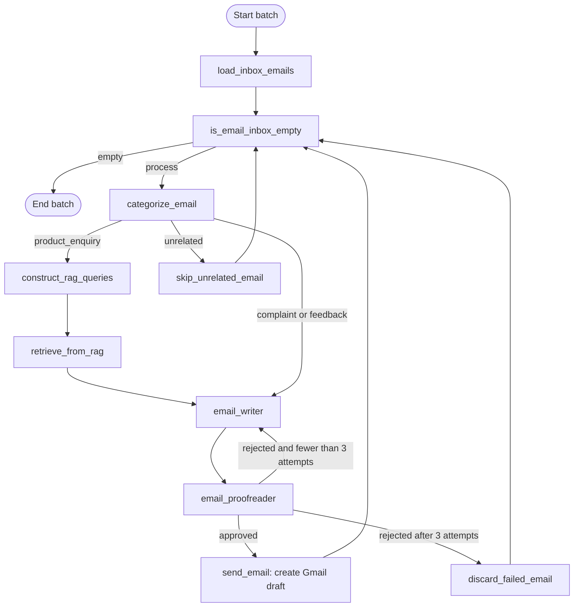

# Technical Workflow: Gmail Email Automation

This guide explains the technologies, source files, authentication, databases, and execution paths in the current program. For installation and running commands, see [README.md](README.md).

The description follows the application code and verified workflow behavior. Versions below describe the tested environment, not necessarily the latest available releases.

## 1. System overview and terminology

This is a Python batch application with an optional HTTP interface. Python controls the sequence and performs Gmail operations. Language-model calls classify, generate retrieval questions, write answers, and review replies.

| Term | Meaning here |
| --- | --- |
| LLM | A large language model that interprets and generates text; the configured model runs on Groq. |
| Agent | A prompt-and-model chain assigned a role. Agents here are not separate processes or separately trained models. |
| Workflow / graph | Connected processing steps and conditions defined in LangGraph. |
| Node | A Python function that receives graph state and returns updates. |
| State | The in-memory queue, current email, retrieval results, drafts, and review attempts. |
| RAG | Retrieval-augmented generation: find relevant knowledge, then supply it to the model when generating an answer. |
| Embedding | A numerical vector representing text for similarity search, rather than a generated reply. |
| Vector database | Storage that can retrieve documents by embedding similarity; Chroma supplies this locally. |
| OAuth 2.0 | Browser-based authorization giving the application access to the selected Google account. |
| API key | A secret authenticating access to an AI provider; it does not replace Gmail user consent. |
| Draft | An editable Gmail message awaiting a person's review and manual send action. |

```text
.env + Desktop OAuth credentials + selected knowledge file
                         |
                 Python application
                         |
            Gmail API -> LangGraph workflow
                         |
          Groq classification / writing / review
                         |
      Google embeddings <-> local Chroma retrieval
                         |
          Gmail draft -> human review -> manual send
```

Only product inquiries use retrieval. Complaints and feedback go directly to the writer. The final manual send happens in Gmail, outside the active graph.

## 2. Project file map

| File or directory | Responsibility |
| --- | --- |
| `main.py` | One real Gmail batch; streams node updates, counts outcomes, writes `last_run.json` on success. |
| `create_index.py` | Loads selected knowledge, chunks it, requests embeddings, updates Chroma, tests retrieval. |
| `demo.py` | Real AI calls with a synthetic email, fake Gmail adapter, and separate synthetic index. |
| `check_setup.py` | Configuration and limited connectivity checks without reading messages. |
| `deploy_api.py` | FastAPI application exposing the same graph through LangServe. |
| `run.ps1` | Windows launcher selecting an entry point and invoking `.venv\Scripts\python.exe`. |
| `src/config.py` | Loads `.env`, resolves paths, selects models, source, database, and sample notice. |
| `src/graph.py` | Registers nodes and routes, compiles `Workflow().app`. |
| `src/nodes.py` | Implements each action and transition decision. |
| `src/agents.py` | Constructs prompt/model chains and the retriever. |
| `src/prompts.py` | Instructions for classification, queries, contextual answers, writing, and review. |
| `src/state.py` | `Email` Pydantic model and `GraphState` TypedDict. |
| `src/structure_outputs.py` | Enum and Pydantic schemas for model responses; the filename is spelled this way in the code. |
| `src/tools/GmailTools.py` | OAuth, Gmail queries, parsing, reply formatting, draft creation, and an unused send helper. |
| `data/sample.txt` | Fictional knowledge selected in sample mode. |
| `data/agency.example.txt` | Published placeholder template for business knowledge. |
| `data/agency.txt` | Private, Git-ignored business knowledge selected in production mode; create and customize before use. |
| `db_sample_live/` | Live sample Chroma index. |
| `db_gemini_embedding_001/` | Production index location, created when built. |
| `db_demo/` | Separate synthetic demo index. |
| `db/` | Preserved legacy index; not loaded by current modes. |
| `.env.example` | Published environment template containing no working secrets. |
| `.env` | Private email address, provider keys, and mode/model settings. |
| `credentials.json` | Downloaded Google Desktop OAuth client configuration. |
| `token.json` | User credentials saved after browser authorization. |
| `last_run.json` | Counters and UTC completion time from the last successful CLI batch. |
| `requirements.txt` | Unpinned top-level dependencies. |
| `requirements-lock.txt` | Exact package snapshot, including transitive dependencies. |
| `test_workflow.py` | Mocked regression tests for queue progress and retry behavior. |
| `workflow.png` | Supplied original workflow illustration. |
| `.venv/` | Working Python environment. |
| `venv/` | Old environment in this copy, pointing to a missing Python installation. |

Generated files may not exist in a fresh download. Recreate virtual environments on a new computer instead of copying them.

## 3. Current workflow graph

### Supplied PNG


Three details in this image differ from the current code:

- `load_new_emails` is the Python method name; the registered graph node is `load_inbox_emails`.
- `send_email` is wired to **create a Gmail draft**, not send mail.
- The image routes `stop` directly back to classification. The current graph uses `discard_failed_email` and checks the queue first, avoiding an empty-queue error after the last rejected email.

### Diagram matching the implementation



Successful drafts, unrelated skips, and exhausted-review skips all call `finish_email()` to remove the current item and reset per-email state. The inbox queue is fetched once at batch start, not refreshed after each email.

## 4. Languages, formats, frameworks, libraries, and tools

### Languages and formats

| Technology | Definition and use |
| --- | --- |
| Python 3.12 | General-purpose language running application logic, integrations, indexing, tests, and HTTP server. The tested environment uses 3.12.14. |
| PowerShell | Windows shell and scripting language used for setup and `run.ps1`. |
| Markdown / Mermaid | Documentation markup and text-based graph notation used by these guides. |
| JSON / JSON Schema | Structured data and its validation contract; used by OAuth files, summaries, HTTP requests, and model outputs. |
| HTML / MIME | Body markup and email packaging used to build Gmail reply drafts. |
| UTF-8 | Text encoding used for knowledge files and local text. |
| Base64url | URL-safe encoding used to decode Gmail body data and encode the outgoing MIME message. |
| PNG | Raster image format of the supplied workflow illustration. |

There is no custom JavaScript frontend. Gmail is the review interface; API docs and the LangServe playground are optional developer interfaces.

### AI and workflow packages

| Package and tested version | Definition | Use in this code |
| --- | --- | --- |
| `langchain-core` 1.6.1 | Core prompt, message, runnable, and parser abstractions | `PromptTemplate`, `ChatPromptTemplate`, `MessagesPlaceholder`, `RunnablePassthrough`, `StrOutputParser`; the `|` operator composes stages. |
| `langgraph` 1.2.11 | Stateful graph execution framework | `StateGraph`, nodes, conditional edges, compilation, queue processing. |
| `langchain-groq` 1.1.3 | LangChain adapter for Groq | `ChatGroq` model calls with temperature 0.1 and structured outputs. |
| `langchain-google-genai` 4.4.0 | Google AI integration | `GoogleGenerativeAIEmbeddings` for knowledge and query vectors. No Gemini chat model is used by current agents. |
| `langchain-chroma` 1.1.0 | LangChain adapter for Chroma | Persistent stores, `as_retriever()`, similarity search. |
| `chromadb` 1.5.9 | Embedded vector database | Local storage of chunks, IDs, metadata, embeddings, and similarity indexes. |
| `langchain-community` 0.4.2 | Collection of integrations | `TextLoader`; installed versions may emit a maintenance/deprecation warning, separate from a runtime failure. |
| `langchain-text-splitters` 1.1.2 | Text chunking utilities | Overlapping chunks using `RecursiveCharacterTextSplitter`. |
| `pydantic` 2.13.5 | Data validation and schema library | Email objects and typed model responses; installed transitively and recorded in the lock file. |
| `typing-extensions` | Backported typing constructs | `TypedDict` documents graph state fields. |

The configured chat model is `openai/gpt-oss-120b` through Groq. Google's embedding model is `models/gemini-embedding-001`. The variable named `llama` in `agents.py` still holds whichever Groq model is configured; its name does not select a Llama model.

The provider SDKs `groq` and `google-genai`, HTTP clients, NumPy, and other supporting packages arrive through dependencies. `requirements-lock.txt` contains their exact installed versions. They are not additional services requiring separate accounts.

### Gmail, configuration, and terminal packages

| Package and tested version | Definition and use |
| --- | --- |
| `google-api-python-client` 2.200.0 | Google API client; `build('gmail', 'v1', credentials=...)` constructs the Gmail service. |
| `google-auth` 2.57.1 | Loads authorized-user credentials and refreshes access tokens. |
| `google-auth-oauthlib` 1.4.1 | Browser OAuth flow; `InstalledAppFlow` receives the callback on a local port. |
| `google-auth-httplib2` 0.4.2 | Authenticated HTTP transport support for the Google client. |
| `beautifulsoup4` 4.15.0 | Parses HTML, removes non-content elements, and extracts visible email text. |
| `python-dotenv` 1.2.3 | Loads `.env` values into process environment settings. |
| `colorama` 0.4.6 | Colors terminal progress messages. |

Standard-library modules include `os`/`pathlib` for settings and paths, `datetime` for windows and timestamps, `json` for files, `hashlib` for chunk IDs, `re` for cleanup, `email.mime`/`base64` for replies, and `urllib.request` for setup probes. `uuid` is used by the unused direct-send helper. `unittest` and `unittest.mock` provide local tests and the simulated Gmail adapter.

### Optional API and development tools

| Component | Definition and use |
| --- | --- |
| `fastapi` 0.141.1 | API framework providing the optional application and documentation. |
| `langserve` 0.3.3 | Exposes the compiled runnable over HTTP, including schemas and streaming. |
| `uvicorn` 0.52.4 | ASGI server launched by `deploy_api.py`. |
| `sse-starlette` 3.4.10 | Server-sent-event support for LangServe streaming. |
| `gunicorn` 26.2.0 | Unix-oriented web-server/process-manager dependency; not invoked by this Windows setup. |
| `pip` | Installs dependency lists and pinned packages. |
| `venv` | Isolates the project's Python packages in `.venv`. |
| Browser | Google consent, Gmail Drafts, API docs, and playground access. |

No external MySQL, PostgreSQL, Redis, hosted Chroma server, message broker, or model-training pipeline is configured.

## 5. Configuration and authentication

### Credential responsibilities

| Item | What it is | Used for | Location |
| --- | --- | --- | --- |
| `MY_EMAIL` | Mailbox address, not a secret key | Sender filtering and intended mailbox identity | `.env` |
| `GROQ_API_KEY` | Provider API secret | Classification, queries, answers, writing, and review | `.env` |
| `GOOGLE_API_KEY` | Gemini API secret | Knowledge and query embeddings | `.env` |
| `credentials.json` | Desktop OAuth client ID and client secret | Identifying the application during authorization | Project root |
| `token.json` | Authorized-user credentials | Gmail access as the selected account | Generated in project root |

See [Groq key setup](https://console.groq.com/docs/quickstart) and [Google embedding key setup](https://ai.google.dev/gemini-api/docs/api-key). AI keys are not Gmail passwords. No OpenAI key, SMTP app password, or LangSmith key is required by active code.

### Gmail login lifecycle

`GmailToolsClass.__init__()` calls `_get_gmail_service()`. Valid `token.json` credentials are reused. Expired access credentials with a refresh token are refreshed. Otherwise, the code reads the Desktop client's `installed` section and starts `InstalledAppFlow.run_local_server(port=0)`.

The operating system selects an available local callback port. After browser consent, credentials are saved in `token.json` and used to build the Gmail v1 client. Follow the [README setup](README.md#5-configure-gmail-oauth) and [Google's quickstart](https://developers.google.com/workspace/gmail/api/quickstart/python).

The scope is `https://www.googleapis.com/auth/gmail.modify`. It permits more than read-only access; Python limits the active workflow to reading and creating drafts. `userId='me'` means the account represented by the token. Changing `MY_EMAIL` does not switch Google accounts. Make sure the token account matches `MY_EMAIL`; normal startup does not perform a profile comparison.

### Mode selection

`src/config.py` resolves the root from its own path and loads `.env`. Existing process environment values take precedence. `KNOWLEDGE_MODE` accepts `sample` or `production`, defaults to `production` if absent, and is set to `sample` in the published environment template.

| Mode | Knowledge | Database |
| --- | --- | --- |
| Live sample | `data/sample.txt` | `db_sample_live/` |
| Live production | `data/agency.txt` | `db_gemini_embedding_001/` |
| Synthetic demo | Text inside `demo.py` | `db_demo/` |

`demo.py` overrides the agent store path and replaces Gmail only for its own invocation. It still uses the configured model settings. Its synthetic database is populated if empty; editing `data/sample.txt` does not update that independent demo database.

## 6. Knowledge indexing and local databases

### What Chroma stores

Chroma is the only application database used here. Each persistent directory contains `chroma.sqlite3` and vector-index storage managed by Chroma. Application code does not issue SQL or create custom relational tables.

Records include chunk IDs, source text, loader metadata, and numerical embeddings. Local storage does not make processing offline: Google generates embeddings and Groq generates text. Tokens and summaries are separate JSON files. There is no email database or LangGraph checkpoint database.

### Index construction: `create_index.py`

1. Read the selected knowledge file through `TextLoader(..., encoding='utf-8')`.
2. Split with `RecursiveCharacterTextSplitter(chunk_size=300, chunk_overlap=50)`. These use character counts with the default length function, not token counts. Overlap retains context at boundaries.
3. Create `GoogleGenerativeAIEmbeddings` with the configured model and open the selected persistent Chroma store.
4. Generate SHA-256 IDs from each chunk's position and content: `hash(index + ':' + chunk_text)`.
5. Call `add_documents()` to request embeddings and add/update chunks under those IDs.
6. Delete IDs in that selected collection that are no longer part of the current source. A rebuild replaces that source snapshot; this is not a multi-file ingestion system.
7. Test with `similarity_search('What are your pricing options?', k=3)` and report the number of results.

Stable IDs avoid duplicate entries on an unchanged rebuild, but the command can still make embedding requests each time. Never mix vectors from different embedding models, even if dimensions happen to match. Changing the model requires a new directory mapping and a rebuild; there is no automatic model migration or version tracking.

### Retrieval while processing email

`Agents()` opens Chroma, checks that its collection is nonempty, and creates `as_retriever(search_kwargs={'k': 3})`. Each generated product question is embedded through Google and searched locally. Up to three retrieved chunks and the question are passed to Groq for a contextual answer.

`retrieve_from_rag()` combines the questions and generated answers in `retrieved_documents`. Despite the field name, it contains more than raw documents: it is the accumulated question/answer text the writer uses.

See [Google's embedding model explanation](https://ai.google.dev/gemini-api/docs/embeddings). The setup probe observed 3,072 values per embedding with the configured model; application code does not explicitly specify a dimension.

## 7. Detailed execution: from Python to a Gmail draft

### 7.1 Startup

`main.py` imports configuration and constructs `Workflow()`. That class constructs `StateGraph(GraphState)`, creates `Nodes()`, registers actions and routes, and compiles the graph. `Nodes()` creates AI chains before the Gmail client, so a missing index can stop startup before browser sign-in begins.

The CLI passes empty queue, draft, retrieval, history, and trial fields to `app.stream(..., {'recursion_limit': 1000})`. This limit caps graph steps, not writing attempts. Classification fills `current_email` after loading the queue.

### 7.2 Load the mailbox snapshot

`load_new_emails()` calls `fetch_unanswered_emails()` with a default maximum of 50. The Gmail query is:

```text
in:inbox -in:drafts after:<eight-hours-ago-unix-time> before:<now-unix-time>
```

The helper calls `users().messages().list()`, reads a page of drafts, and collects draft thread IDs. It considers one message per unseen thread, skips threads found in the draft set, fetches full message content, and excludes matching senders.

Despite its name, `fetch_unanswered_emails()` does not comprehensively prove a thread is unanswered by inspecting all sent history. It is a recent-message and draft filter. The sender filter uses a substring check against the From header, not normalized address parsing. Neither listing is paginated through every page.

### 7.3 Parse email content

`_get_email_info()` extracts message ID, thread ID, Message-ID, References, From, Subject, and body. Body processing decodes Base64url data, traverses MIME parts, uses BeautifulSoup for HTML, and collapses whitespace. `Email(**email)` validates the resulting object shape.

Although the body helper's description says plain text is preferred, actual traversal returns the first usable plain-text or HTML part encountered. It assumes UTF-8 and does not process attachments or reconstruct full conversation history. Routing and writing mainly use body text. Header values are used later for addressing and threading.

### 7.4 Check and classify

`is_email_inbox_empty()` returns the state. The routing function `check_new_emails()` selects `empty` or `process`. If there is work, `categorize_email()` selects the final queued item (`emails[-1]`) and invokes the classifier.

| Category | Meaning | Route |
| --- | --- | --- |
| `product_enquiry` | Product, service, pricing, or feature question | Retrieval questions → retrieval answers → writer |
| `customer_complaint` | Dissatisfaction or a problem report | Writer directly |
| `customer_feedback` | Feedback or suggestions | Writer directly |
| `unrelated` | Outside the support task | Remove from the current queue without altering the Gmail message |

### 7.5 Generate retrieval queries and answers

`design_rag_queries` converts the email into search questions. Its schema describes up to three questions, but the actual field is `List[str]` without a hard maximum-length validator. The node processes every returned question sequentially.

For each question, `generate_rag_answer` composes retriever context and the unchanged question, applies the answer prompt, calls Groq, and converts the response with `StrOutputParser`. The prompt asks for answers grounded in retrieved material and acknowledgement of missing information. These are model instructions, not a factual guarantee.

Complaints and feedback bypass retrieval. Adding refund policy text to the knowledge base does not automatically cause complaint replies to consult it.

### 7.6 Write and review

The writer sees the email category, body, accumulated retrieval answers, and per-email history through `MessagesPlaceholder('history')`. It returns `WriterOutput.email`. The node increments `trials` and appends the draft to history.

The writer prompt still names **The Agentia Team** in its signature; change the prompt when customizing business identity. Sample mode adds instructions identifying knowledge as fictional. A fixed sample-data notice is also prepended immediately before Gmail draft creation, so labeling does not depend solely on model compliance.

The reviewer receives the original email body and generated reply and returns feedback plus a `send` boolean. Feedback is added to history. Here `send` means approval for saving a draft, not permission to send a message.

The reviewer does not receive raw knowledge documents or a separate retrieval-context argument. It cannot reliably fact-check all claims against the source. Even a reviewed response may contain unsupported statements or unsuitable formatting.

### 7.7 Retry and advance

`must_rewrite()` checks approval first, so an approved third attempt is accepted. A rejected attempt below three returns to the writer; rejection after the third goes to `discard_failed_email`.

Draft success, unrelated skip, and exhausted-review skip call `finish_email()`. It returns an updated queue and clears generated text, retrieval answers, query list, reviewer flag, attempt count, and writer history. Returning these updates explicitly ensures LangGraph records them and gives each new email a fresh retry budget.

A rejected review is different from a model/API exception. There is no catch-all per-email error node; an exception may terminate the batch.

### 7.8 Build and save the threaded draft

The graph node named `send_email` invokes `create_draft_response()`. That method adds the sample notice when needed, calls `create_draft_reply()`, and requires a returned Gmail draft ID before counting success.

The Gmail helper performs these steps:

1. Set the recipient to the original sender and add `Re:` to the subject if needed.
2. Package the reply in an HTML MIME message, converting line breaks to `<br>`.
3. Add `In-Reply-To` and `References` when the original Message-ID exists.
4. Base64url-encode the MIME bytes and include the original Gmail `threadId`.
5. Call `users().drafts().create(userId='me', body={'message': ...})`.

The formatting helper's docstring mentions a plain-text fallback, but the implementation attaches only HTML. It does not render Markdown tables or escape all generated HTML, so inspect the draft in Gmail.

`send_email_response()` and `send_reply()` exist in source but are not connected to the active graph. The graph never calls `users().messages().send()`.

### 7.9 Finish and report

The CLI counts loaded messages, classifications, created drafts, unrelated skips, and exhausted-review skips. After the empty-queue transition, it writes `last_run.json` with those counts and a UTC completion time, then exits.

The summary is not a checkpoint, a complete email audit, or an append-only history. A failed run does not update it, so an older summary may remain. Drafts already confirmed by Gmail remain saved even if a later message fails.

## 8. State and structured responses

### Email and graph state

The `Email` Pydantic model has string fields `id`, `threadId`, `messageId`, `references`, `sender`, `subject`, and `body`. Validation checks shape, not whether message content is trustworthy.

| Graph field | Purpose |
| --- | --- |
| `emails` | Remaining queue of Email objects |
| `current_email` | Email currently processed |
| `email_category` | Selected category string |
| `generated_email` | Latest draft text |
| `rag_queries` | Generated retrieval questions |
| `retrieved_documents` | Concatenated retrieval questions and generated contextual answers |
| `writer_messages` | Per-email draft/review history, stored as a plain list |
| `sendable` | Review approval flag used for draft creation |
| `trials` | Current email's writing-attempt count |

`GraphState` is a TypedDict, not a persistent database. `workflow.compile()` has no configured checkpointer.

### Model response contracts

| Schema | Fields | Consumer |
| --- | --- | --- |
| `CategorizeEmailOutput` | `category`: enum | Category router |
| `RAGQueriesOutput` | `queries`: list of strings | Retrieval loop |
| `WriterOutput` | `email`: string | Reviewer and draft creation |
| `ProofReaderOutput` | `feedback`: string; `send`: boolean | Revision history and routing |

All four chains use `with_structured_output(..., method='json_schema', strict=True)`. This defines a JSON Schema rather than asking the model to pick a tool name. An invalid tool-name response occurred during a live test with the older function-calling approach; the current format was then verified. See [Groq's structured-output documentation](https://console.groq.com/docs/structured-outputs).

Schema conformance yields a usable response structure, not guaranteed factual accuracy. Temperature 0.1 reduces variation but does not make responses fully deterministic.

## 9. Other execution workflows

### Configuration check

`check_setup.py` checks three environment values, the Desktop OAuth file shape, Groq model availability, and a short Google embedding request. It reports token-file and index-file existence. It does not access the mailbox, establish token validity, count indexed documents, or fully test arbitrary replacement models.

### Synthetic demo

`demo.py` runs real models and retrieval while replacing `GmailToolsClass` with `DemoGmail`. The fake adapter provides one product inquiry and captures/prints a response instead of calling Gmail. The agent's store path is patched to `db_demo`. Success requires an empty final queue and at least one simulated approved draft. This is an integration check that consumes API usage, not an offline unit test.

### Regression tests

`test_workflow.py` mocks agents and Gmail while exercising the real graph. One test verifies two successful draft calls and cleared final state. The other rejects both emails three times and checks six writing calls, no drafts, and a clean empty queue. These tests cover progress and bounded retries, not model accuracy or Gmail delivery.

### Optional HTTP service

`deploy_api.py` creates FastAPI, adds CORS middleware, creates the workflow, and registers it with `langserve.add_routes()`. Uvicorn runs the server. LangServe provides invocation, batch, streaming, schema, and playground endpoints; FastAPI supplies `/docs` and `/openapi.json`.

Starting the service initializes knowledge and Gmail clients. Invoking the graph fetches the connected inbox and can create drafts. Input is not an arbitrary-email-only test harness because the first node loads Gmail. Use `demo.py` for isolated tests. API results and streamed events may include graph state and message content, unlike the CLI's count summary.

The API binds the same graph recursion limit of 1000 as the CLI using `Workflow().app.with_config({'recursion_limit': 1000})`. It does not use the CLI's summary-writing loop. The installed LangServe defaults accept only configurable fields from request configuration, so the limit is set server-side rather than exposed as a request override. The launcher sets UTF-8 console output for the LangServe startup banner on Windows.

The server binds only to localhost at `127.0.0.1:8000`, uses permissive CORS, and has no application authentication. It is a developer interface rather than a secured public multi-user deployment. Multiple invocations can overlap; there is no mailbox lock. No scheduler, daemon loop, Gmail push subscription, or recurring background job is configured.

## 10. Data flow and API boundaries

| Destination | Data sent or stored | Purpose |
| --- | --- | --- |
| Local Python memory | Fetched emails, workflow state, draft/review history | Process the queue |
| Google OAuth | Client identity, requested scopes, authorization/token exchanges | Authorize Gmail access |
| Gmail API | Message queries, requested message data, reply draft content and threading fields | Read messages and save drafts |
| Google embedding API | Selected knowledge chunks during indexing; email-derived questions during retrieval | Build searchable vectors |
| Groq | Email bodies and prompts; retrieval questions with source chunks; writer context; drafts and feedback | Classification, answers, writing, review |
| Local Chroma | Knowledge chunks, vectors, metadata, IDs | Persistent semantic search |
| Local `token.json` | Authorized-user credentials | Reuse sign-in |
| Local `last_run.json` | Counters and completion timestamp | Last successful CLI result |

Secrets are loaded locally and passed to their respective providers for authentication, not intentionally included as model prompt content. The model is not given the Gmail service object or arbitrary Gmail tool access; Python makes the calls selected by the graph.

There is no dedicated prompt-injection filter for untrusted email text. Structured output constrains shape, while draft-only execution preserves a human final-send decision. These controls do not guarantee correct facts or appropriate responses to every message.

The `.gitignore` excludes environment secrets, OAuth downloads and renamed credential backups, token files, all root database directories, environments, run summaries, and private knowledge files. The only data exceptions are the synthetic sample and business-knowledge template. These files must stay free of real credentials and private business information.

## 11. Example from knowledge file to reply

Assume sample knowledge describing a fictional USD 19 Starter plan and USD 49 Pro plan:

1. `create_index.py` reads `data/sample.txt`, requests embeddings, and builds `db_sample_live`.
2. Someone sends a service-pricing question from another account to the connected Gmail inbox.
3. `main.py` loads it and classification returns `product_enquiry`.
4. The query chain produces questions about plans and prices.
5. Google embeds those questions; Chroma retrieves relevant sample chunks.
6. Groq generates contextual answers, and the writer drafts a reply.
7. The proofreader approves or requests a revision, up to three writing attempts.
8. The draft node adds the fixed sample notice and Gmail returns a draft ID.
9. The queue advances; successful batch completion updates `last_run.json`.
10. The person opens Gmail Drafts, corrects fictional facts and formatting, and decides whether to send.

Live testing has verified complaint and product-inquiry draft creation along with unrelated-message skipping. This validates the Gmail draft path, not continuous monitoring; each launch still runs one batch.

## 12. Current limitations and customization

| Area | Current behavior | Where to change it |
| --- | --- | --- |
| Window and batch size | Last eight hours, up to 50 returned messages | Gmail fetching helpers |
| Pagination | One message-list page and one draft-list page; duplicate avoidance is incomplete for large draft folders | Gmail listing helpers |
| Previously handled threads | No permanent processed-ID ledger or complete sent-thread check; skipped emails can be re-examined | Gmail filtering and future persistence |
| Scheduling | One batch per CLI launch | Separate scheduling design |
| Knowledge formats | One UTF-8 source per selected live mode | `create_index.py` |
| Retrieval | Up to three chunks per query; no explicit relevance threshold or returned source citations | `src/agents.py` and prompts |
| Complaints/feedback | Bypass policy retrieval | Graph category routes |
| Company identity | Example team signature in the writer prompt | `src/prompts.py` |
| Query count | Description requests up to three; no hard list-length validator | `RAGQueriesOutput` |
| Reviewer evidence | Original email and draft, without raw source context | Review node and prompt |
| Error recovery | Exceptions may abort the batch; no persisted graph checkpoint | Runner and future error/checkpoint design |
| Concurrency | No lock or atomic cross-run duplicate prevention | Runner and Gmail adapter |
| Email formatting | HTML-only outgoing body, simple MIME traversal, UTF-8 assumption | Gmail parsing and formatting helpers |
| Automatic sending | Helpers exist but are disconnected | Wiring them would change draft-only behavior |
| Chat-model changes | Four chains require compatible strict JSON Schema support | `GROQ_MODEL` and `src/agents.py` |
| Embedding changes | No automatic migration of vectors | Model setting, directory mapping, and rebuild |

Keep these guides and diagrams aligned with future code changes. Graph source and node implementations are authoritative when an old comment or illustration differs.
